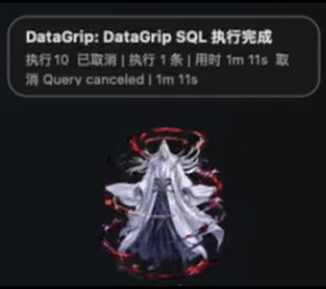

# WorkPet

[中文](README.md) | [English](README.en.md)

WorkPet 是一个原生 macOS 桌面电子宠物工作通知中枢。它的目标不是做复杂养成游戏，而是用一个可置顶、可跨 Space 尝试显示的宠物浮窗，把工作中容易错过的重要消息提醒出来。

> 软件源代码采用 MIT 许可证；内置宠物素材的授权说明见 `NOTICE.md`。

## 预览

### 消息通知动画

收到不同来源的消息，宠物会弹出气泡并播放对应的专属动画：

微信消息 / 飞书消息：

 

日历行程 / DataGrip 任务：

 

### 待机动画

长时间没有消息时，宠物会在多组待机动画间轮换（站立 / 依偎 / 生死意境）：

  

## 当前能力

已实现：

- 原生 AppKit 浮窗，支持拖拽、置顶、跨 Space / 全屏辅助显示尝试。
- 通知中枢 `NotificationHub`，支持来源分级、去重和统一投递。
- 今日待办：通过 EventKit 读取 macOS 日历当天事件。
- 微信 / 飞书消息提醒：监听 macOS 通知数据库，实时捕获新通知，解析发送者与正文，自动区分私聊 / 群聊 / 公众号 / 系统消息，并触发对应来源的专属宠物动画。
- 消息规则过滤：按应用、消息分类、发送者和关键词配置白名单 / 黑名单，决定强提醒、普通提醒或静默。
- 菜单栏未读兜底：可选通过辅助功能 API 读取微信、飞书菜单栏未读数变化。
- DataGrip 文件钩子：监听任务完成文件并推送。
- DataGrip 自动监听插件：通过 JetBrains 插件监听 DataGrip SQL 执行批次。
- 启动诊断：检查日历权限、通知数据库读取权限、DataGrip 监听目录。
- 图片资源包宠物系统：通过 `pet.json + png/jpg/webp` 替换宠物。
- 右键菜单：选择宠物、互动、刷新今日待办、免打扰、退出。

尚未完成：

- 微信 / 飞书开放平台专用 API 接入（当前通过 macOS 通知通道读取消息已可用；专用 API 用于获取更完整的会话与历史消息，并摆脱对系统通知横幅的依赖）。
- 偏好设置界面。
- 正式签名、自动更新和生产级分发。

## 项目结构

```text
WorkPet/
  WorkPet/                 # Swift Package macOS App
  datagrip-plugin/         # DataGrip 自动监听插件
  docs/                    # 中文文档
  scripts/                 # 日用脚本和资源生成脚本
  build-app.sh             # 打包 WorkPet.app
```

## 环境要求

- macOS 14.0+
- Swift 5.10+（Xcode Command Line Tools 即可，无需 Xcode 工程）
- 构建 DataGrip 插件（可选）：JDK 17+ 与本地已安装的 DataGrip

## 构建

先将 `REPO_ROOT` 设置为仓库根目录：

```bash
export REPO_ROOT="$(pwd)"
```

```bash
cd "$REPO_ROOT/WorkPet"
swift build
swift test
```

## 运行

开发运行：

```bash
cd "$REPO_ROOT/WorkPet"
swift run WorkPet
```

打包为 `.app`：

```bash
cd "$REPO_ROOT"
./build-app.sh
open build/WorkPet.app
```

## 日用配置

详见 [日常使用](docs/DAILY_USE.md)。

## DataGrip

- 手动文件钩子见 [DataGrip 文件钩子接入](docs/DATAGRIP_INTEGRATION.md)。
- 自动监听 SQL 执行批次见 [DataGrip 自动监听插件](docs/DATAGRIP_AUTO_MONITOR.md)。

构建自动监听插件：

```bash
cd "$REPO_ROOT/datagrip-plugin"
./build-local.sh   # 产物: build/WorkPetDataGripNotifier.zip
```

在 DataGrip 中安装：Settings > Plugins > 齿轮图标 > Install Plugin from Disk...，选择生成的 zip。

## 消息规则

微信、飞书等消息应用可以按个人、群组、公众号、系统消息分类过滤，并支持白名单和黑名单。详见 [消息应用规则配置](docs/MESSAGE_RULES.md)。

## 隐私、权限与数据边界

WorkPet 是本地运行的 macOS 应用，不包含远程服务、账号登录或 API Key 配置。当前实现可能访问以下本机数据：

- **日历和提醒事项**：通过 EventKit 读取当天日程、提醒标题、时间、地点和备注摘要。
- **系统通知数据库**：只读 macOS 通知数据库，用于识别微信、飞书等通知；这通常需要给运行中的 App 或终端授予“完全磁盘访问权限”。
- **辅助功能**：可选地读取微信、飞书菜单栏未读数，需要“辅助功能”权限。
- **DataGrip 状态**：读取本地 `~/Library/Application Support/WorkPet/datagrip-tasks/` 下的任务文件；插件写入执行完成/失败摘要，不主动上传 SQL 或数据库凭据。

这些数据只在本机用于生成提醒，项目没有实现网络上传通道。用户可以不授予相关权限，未授权的适配器会保持不可用。

## 资源与授权

软件源代码采用 MIT 许可证，见 `LICENSE`。

内置宠物资源包位于 `WorkPet/Sources/WorkPet/Resources/PetPacks/`，其图片素材不在 MIT 许可证授权范围内，单独说明见 `NOTICE.md`：

- `orange-cat/`：项目自有的示例资源包。
- `wang-lin/`：维护者提供的宠物皮肤资源包，`wang-lin/frames/` 为应用直接使用的帧资源，作为内置皮肤随仓库分发。

贡献新的图片、视频、字体或代码时，请先确认版权与许可证，并同步更新 `NOTICE.md`。

## 宠物资源包

WorkPet 使用图片资源包渲染宠物。详见 [宠物资源包](docs/PET_ASSET_PACKS.md)。
